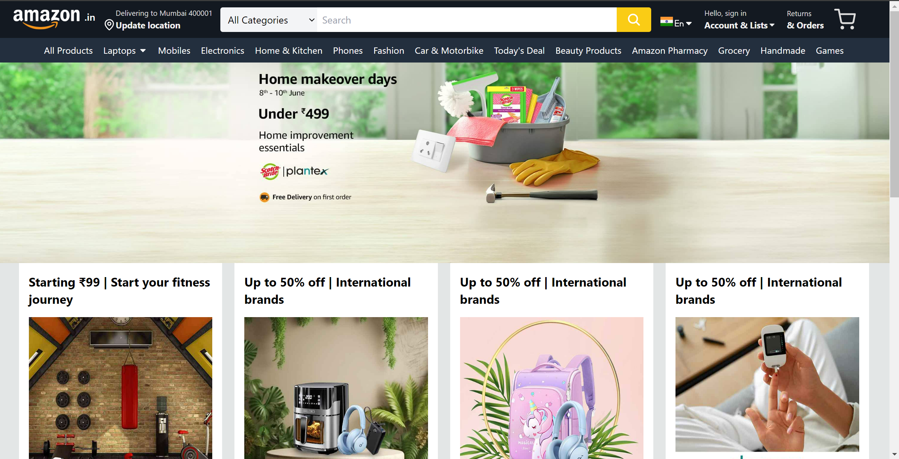
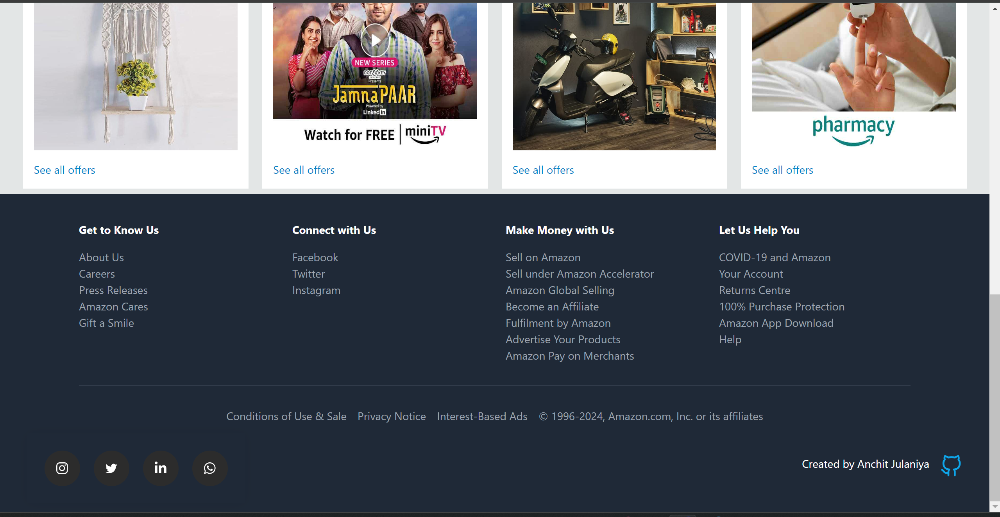
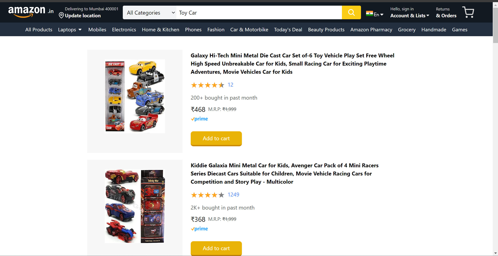
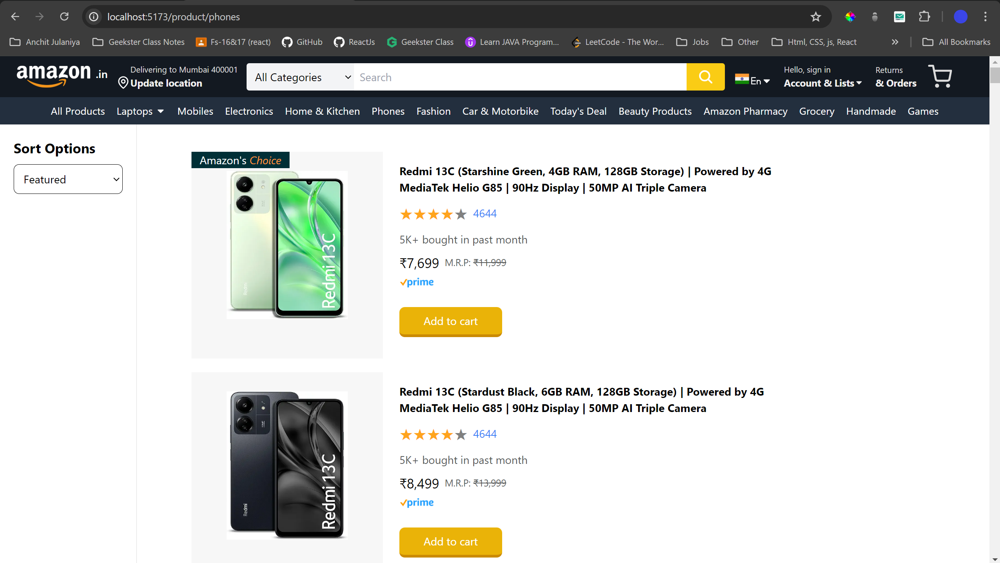
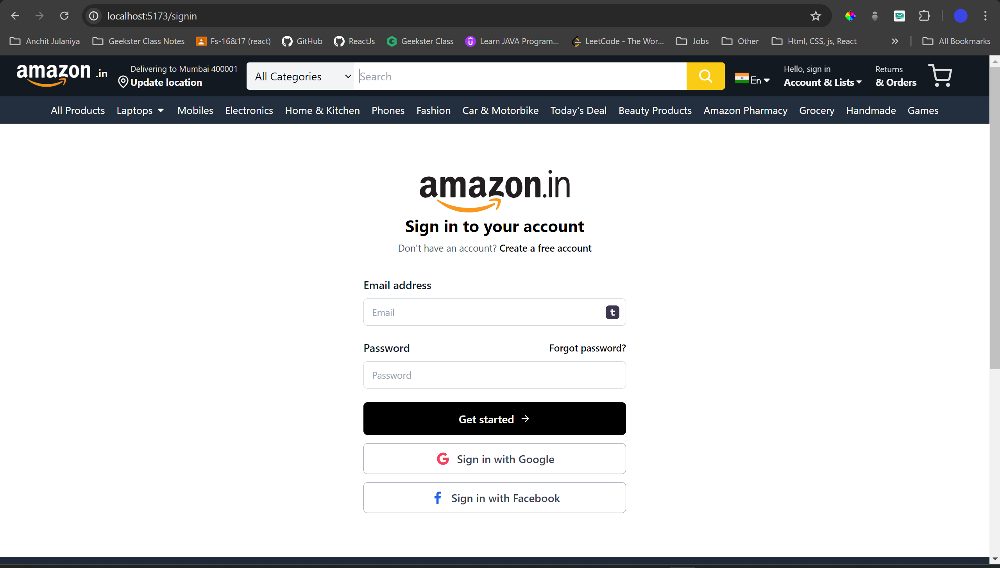
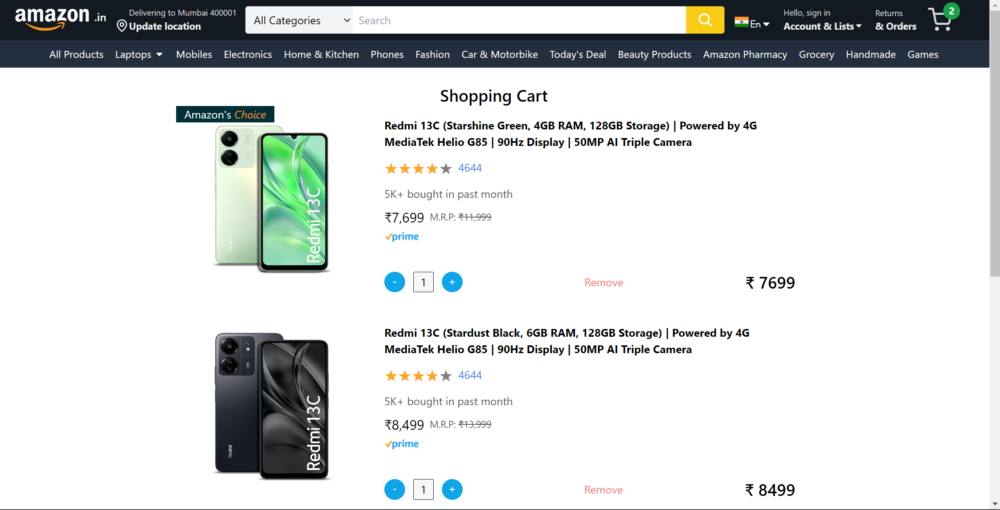
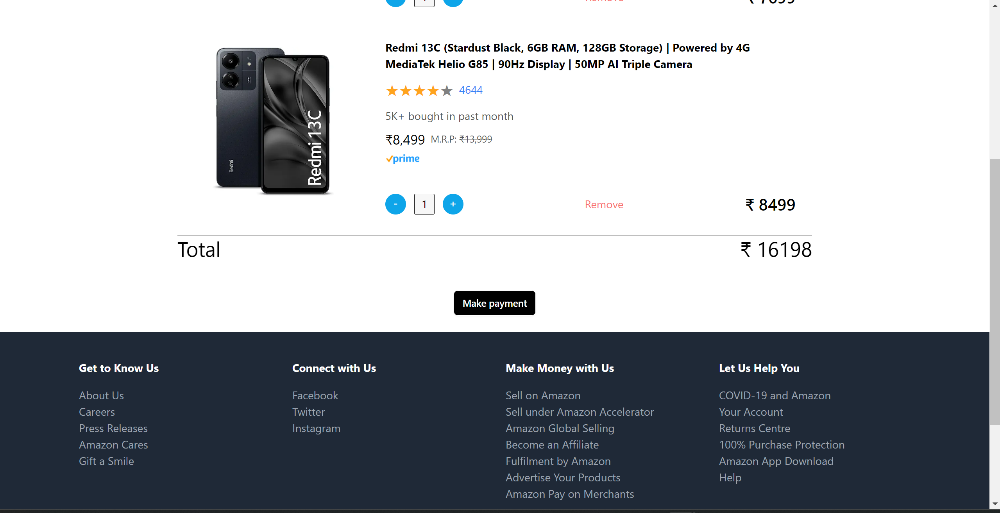
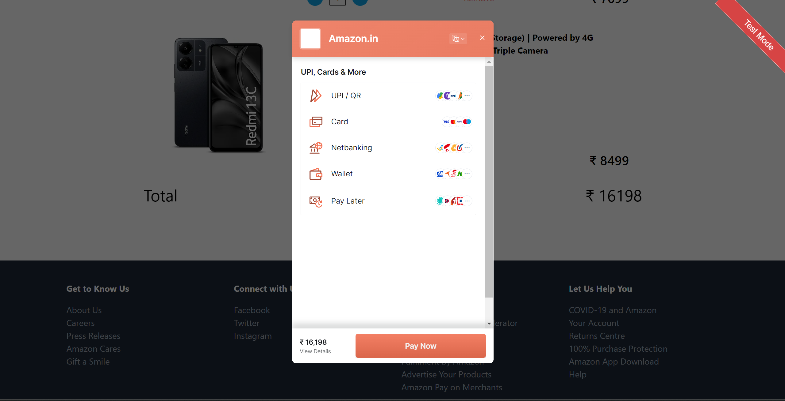

# Amazon Clone E-Commerce Platform

## 📝 Overview

This project is an Amazon Clone built using React and Firebase, integrating the Razorpay payment gateway. The platform utilizes the Amazon Product Data API for product listings. The project involves collaboration using GitHub.






## ✨ Features

- **User Authentication**: Sign up and login functionality using Firebase Authentication.
- **Product Listings**: Fetching and displaying products using the Amazon Product Data API.
- **Shopping Cart**: Add, remove, and manage products in the shopping cart.
- **Checkout Process**: Seamless checkout process with Razorpay payment gateway integration.
- **Order History**: View past orders and purchase history.
- **Responsive Design**: Mobile-first responsive design using CSS and React.


## 💻 Tech Stack

- **Frontend**: React, CSS, HTML
- **Backend**: Firebase (Firestore, Authentication)
- **Payment Gateway**: Razorpay
- **External API**: Amazon Product Data API
- **Collaboration**: GitHub




## 🚀 Getting Started

### Prerequisites

- Node.js (v14 or above)
- npm or yarn
- Firebase account
- Razorpay account
- Amazon Product Advertising API credentials
- GitHub account




### 📦 Installation

1. **Clone the repository**:
    ```sh
    git clone https://github.com/yourusername/amazon-clone.git
    cd amazon-clone
    ```

2. **Install dependencies**:
    ```sh
    npm install
    # or
    yarn install
    ```

3. **Firebase Configuration**:
    - Create a Firebase project in the Firebase console.
    - Enable Firestore and Authentication.
    - Copy the Firebase configuration details and add them to a `.env` file at the root of the project:
      ```env
      REACT_APP_FIREBASE_API_KEY=your_api_key
      REACT_APP_FIREBASE_AUTH_DOMAIN=your_auth_domain
      REACT_APP_FIREBASE_PROJECT_ID=your_project_id
      REACT_APP_FIREBASE_STORAGE_BUCKET=your_storage_bucket
      REACT_APP_FIREBASE_MESSAGING_SENDER_ID=your_messaging_sender_id
      REACT_APP_FIREBASE_APP_ID=your_app_id
      ```






4. **Razorpay Configuration**:
    - Create a Razorpay account and get your API keys.
    - Add the Razorpay keys to the `.env` file:
      ```env
      REACT_APP_RAZORPAY_KEY_ID=your_razorpay_key_id
      REACT_APP_RAZORPAY_KEY_SECRET=your_razorpay_key_secret
      ```

      


5. **Amazon Product Data API Configuration**:
    - Sign up for the Amazon Product Advertising API and get your credentials.
    - Add the Amazon API keys to the `.env` file:
      ```env
      REACT_APP_AMAZON_API_KEY=your_amazon_api_key
      REACT_APP_AMAZON_API_SECRET=your_amazon_api_secret
      REACT_APP_AMAZON_ASSOCIATE_TAG=your_amazon_associate_tag
      ```

6. **Run the Application**:
    ```sh
    npm start
    # or
    yarn start
    ```

## 📁 Project Structure
amazon-clone/   
│  
├── public/  
│ └── index.html  
│  
├── src/  
│ ├── components/  
│ │ ├── Cart.js  
│ │ ├── Checkout.js  
│ │ ├── Header.js  
│ │ ├── Product.js  
│ │ └── ...  
│ │
│ ├── context/  
│ │ └── AuthContext.js  
│ │
│ ├── hooks/   
│ │ └── useAuth.js  
│ │
│ ├── pages/  
│ │ ├── HomePage.js  
│ │ ├── LoginPage.js  
│ │ ├── ProductPage.js  
│ │ └── ...
│ │
│ ├── services/  
│ │ ├── amazonApi.js  
│ │ ├── firebase.js  
│ │ └── razorpay.js  
│ │
│ ├── App.js  
│ ├── index.js  
│ └── ...   
│
├── .env  
├── .gitignore  
├── package.json  
└── README.md  


## 🤝 Collaboration

This project uses GitHub for collaboration. Follow these steps to contribute:

1. **Fork the repository**: Click on the 'Fork' button at the top right of the repository page.

2. **Clone your fork**:
    ```sh
    git clone https://github.com/yourusername/amazon-clone.git
    cd amazon-clone
    ```

3. **Create a new branch**:
    ```sh
    git checkout -b feature/your-feature-name
    ```

4. **Make your changes**.

5. **Commit your changes**:
    ```sh
    git commit -m "Add some feature"
    ```

6. **Push to the branch**:
    ```sh
    git push origin feature/your-feature-name
    ```

7. **Open a pull request**: Go to the repository on GitHub and open a pull request to the main branch.

## ⚖️ License

This project is licensed under the MIT License.

## 🙌 Acknowledgements

- [React](https://reactjs.org/)
- [Firebase](https://firebase.google.com/)
- [Razorpay](https://razorpay.com/)
- [Amazon Product Advertising API](https://affiliate-program.amazon.com/)
- [GitHub](https://github.com)


## ✉️ Contact

If you have any questions, suggestions, or feedback, feel free to reach out:

- **Email**: [your-email@example.com](mailto:anchitjulaniyaofficial@example.com)
- **GitHub**: [your-github-username](https://github.com/anchitjulaniya)
- **Twitter**: [@your-twitter-handle](https://twitter.com/Anchit_Julaniya)

We look forward to hearing from you!


